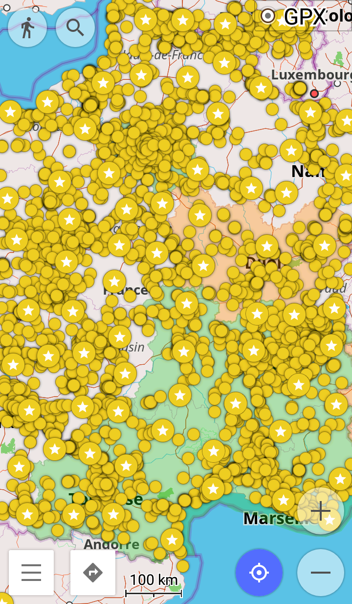

## Summary
In this repository, you will find "public bookcases" exported from website: https://www.boite-a-lire.com/

Note: boite-a-lire.com publish those data under [CC-BY-NC-SA](https://creativecommons.org/licenses/by-nc-sa/2.0/) license.

Those bookcases are mainly located in France and french speaking countries. You can display them in OsmAnd, JOSM, uMap etc.

### View all bookcases (OSM + boite-a-lire.com)

[Map of OSM bookcases and 2022-09-17 dataset](http://u.osmfr.org/m/394538)

In this map:
- OSM bookcases are displayed in **green**  on zoom 14+ with 1 hour cache
- boite-a-lire.com bookcases are displayed in **red** 

### View only boite-a-lire.com

You can view all bookcases from those data here: 

|Date      |Bookcases|Map                                       |
|----------|---------|------------------------------------------|
|2022-09-17|8571     |[Map with 2022-09-17 data](http://u.osmfr.org/m/808996)|
|2020-09-28|6740     |[Map with 2020-09-28 data](http://u.osmfr.org/m/504237)|
|2019-12-01|5551     |[Map with 2019-12-01 data](http://u.osmfr.org/m/394535)|
|2019-09-07|5206     |[Map with 2019-09-07 data](http://u.osmfr.org/m/362282)|
|2019-05-27|4795     |[Map with 2019-05-27 data](http://u.osmfr.org/m/362245)|

### Repo hierarchy

- **YYYY-MM-DD**: date I export data from the website.
  - **bookcase.gpx**: favourite file to use in OsmAnd.
  - **bookcase.geojson**: file to use in JOSM.

## WARNING !!! DO NOT IMPORT IN OPENSTREETMAP !!!

:warning: **DO NOT IMPORT THOSE DATA IN OPENSTREETMAP !!!** :warning:

Those "*supposed bookcases*" needs to be checked by a survey **in real life**, on the field.

You need to go on each "*supposed bookcases*", **check if it exists**, then you can add this bookcase in OSM.

## How to use data ?

The main goal of those data is to find potential bookcases.
So you can grab/exchange some books.
You may also want to use those data to improve OpenStreetMap.
But you need to check if those bookcases exists in real life before adding it in OpenStreetMap

### With OsmAnd ?

NB: i do not recommand to import the whole file "bookcase.gpx" because OsmAnd will become lagguy. Instead use the gpx in "Régions Françaises" folder.

1. Download bookcase.gpx from the latest export
1. Copy bookcase.gpx to your device
1. Open OsmAnd on your device
1. Go to Favorites
1. Use the button **+** (import button)
1. Select file bookcase.gpx
1. It's done, bookcases are displayed on the map

### With JOSM ?

1. Download bookcase.gpx from the latest export
1. Use button Open File in JOSM
1. Select file bookcase.gpx
1. It's done, bookcase are displayed on the map

## How to extrack data ?

### Extract data from web site

1. Visit https://www.boite-a-lire.com/
1. Wait until the map is fully loaded
1. Save the web page on your desktop and open it in your editor
1. Search for "var json" and keep only these lines
1. Copy these lines in the file "webPageToGeojson.js" (follow the template)
1. Run the script in your browser devtools (or maybein nodejs)
1. Copy the result in a geojson file

### Filter bookcase by french region

Prerequisites
- JOSM with plugin UtilPlugin2

1. Open the geojson in JOSM
1. Import region from file assets/georef-france-region.geojson
1. Select a region and merge it in bookcase layer
1. Be sure your region is select
1. Press Alt+Maj+I to select all bookcases inside the region
1. Copy/paster these bookcase in a new layer Ctr+C / Ctrl+Alt+V
1. Delete the region contour
1. Save the layer as a new geojson file with region name

## Stats

|Date      |Bookcases|Bookcase without description|
|----------|---------|----------------------------|
|2022-09-17|     8571|                        1356|
|2020-09-28|     6740|                        1093|    
|2019-12-01|     5551|                         919|
|2019-09-07|     5206|                         842|
|2019-05-27|     4795|                         764|

## Stats by region 

|Region                 |2019-12-01|2022-09-17|
|-----------------------|----------|----------|
|Total                  |      5551|      8756|
|Duplicates             |          |       185|
|Uniques                |          |      8571|
|Out France Metro       |          |       343|
|France métro           |      5291|      8228|
|Nouvelle Aquitaine     |       871|      1307|
|Ile de France          |       671|      1050|
|Auvergne Rhone-Alpes   |       646|      1174|
|Occitanie              |       436|       736|
|Grand Est              |       448|       673|
|Hauts de France        |       361|       565|
|Pays de la Loire       |       361|       519|
|Bretagne               |       359|       504|
|Bourgogne Franche-Comte|       288|       437|
|Normandie              |       311|       430|
|Centre Val de Loire    |       300|       412|
|PACA                   |       240|       412|
|Corse                  |         9|         9|
