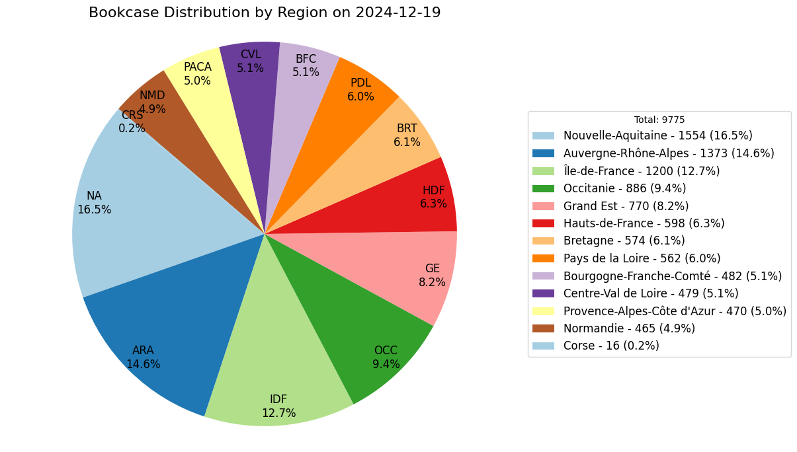

# bookcases-boite-a-lire

This repository host public bookcases exported from: https://www.boite-a-lire.com/

Note: boite-a-lire.com publishes those data under [CC-BY-NC-SA](https://creativecommons.org/licenses/by-nc-sa/2.0/) license.

Those bookcases are mainly located in France and french speaking countries. You can display them in OsmAnd, JOSM, uMap etc.

## View bookcases on a map

- [Bookcases from OSM and boite-a-lire.com (2024-10-03)](http://u.osmfr.org/m/394538)

In this map:
- OSM bookcases are displayed in **green**  on zoom 14+ with 1 hour cache
- boite-a-lire.com bookcases are displayed in **red** 

## Repo hierarchy

- **YYYY-MM-DD**: date I export data from the website.
  - **bookcases.gpx**: favourite file to use in OsmAnd.
  - **bookcases.geojson**: file to use in JOSM.

## WARNING! DO NOT IMPORT IN OPENSTREETMAP!

:warning: **DO NOT IMPORT THOSE DATA IN OPENSTREETMAP!** :warning:

Those "*supposed bookcases*" needs to be checked by a survey **in real life**, on the field.

You need to go on each "*supposed bookcases*", **check if it exists**, then you can add this bookcase in OSM.

## How to use data ?

The main goal of those data is to find potential bookcases.
So you can grab/exchange some books.
You may also want to use those data to improve OpenStreetMap.
But you need to check if those bookcases exists in real life before adding it in OpenStreetMap

### With OsmAnd ?

NB: do not import "bookcases.gpx" because OsmAnd can be lagguy. Instead use one of the gpx in "Régions Françaises" folder.

1. Download bookcases.gpx from the latest export
2. Copy bookcases.gpx to your device
3. Open OsmAnd on your device
4. Go to Favorites
5. Use the button **+** (import button)
6. Select file bookcases.gpx
7. It's done, bookcases are displayed on the map

### With JOSM ?

1. Download bookcases.gpx from the latest export
2. Use button Open File in JOSM
3. Select file bookcases.gpx
4. It's done, bookcase are displayed on the map

## How to update data ?

1. Run `1_fetch_bookcases.py` to fetch bookcase and create bookcases.geojson
2. Run `2_filter_by_region.py` to split the bookcases in one geojson file for each french region
3. Run `3_create_OsmAnd_gpx.py` to convert each geojson file into a OsmAnd favorite GPX file

## Stats

|Region                 |2019-12-01|2022-09-17|2024-10-03|
|-----------------------|----------|----------|----------|
|Total                  |      5551|      8756|      9885|
|Duplicates             |          |       185|       199|
|Uniques                |          |      8571|      9686|
|Out France Metro       |          |       343|       346|
|France métro           |      5291|      8228|      9340|
|Nouvelle Aquitaine     |       871|      1307|      1538|
|Ile de France          |       671|      1050|      1197|
|Auvergne Rhone-Alpes   |       646|      1174|      1356|
|Occitanie              |       436|       736|       877|
|Grand Est              |       448|       673|       767|
|Hauts de France        |       361|       565|       597|
|Pays de la Loire       |       361|       519|       559|
|Bretagne               |       359|       504|       555|
|Bourgogne Franche-Comte|       288|       437|       482|
|Normandie              |       311|       430|       464|
|Centre Val de Loire    |       300|       412|       466|
|PACA                   |       240|       412|       470|
|Corse                  |         9|         9|        12|
